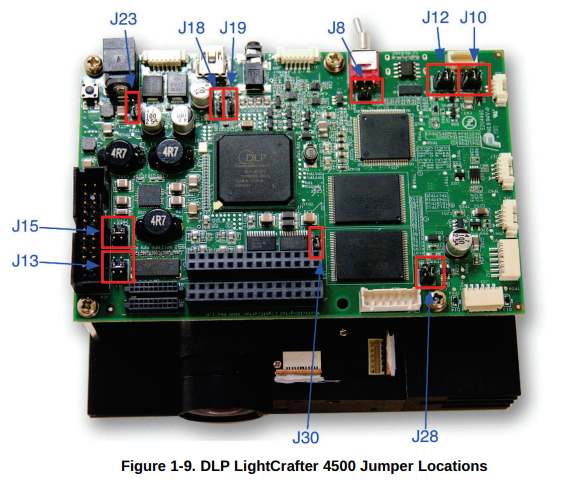
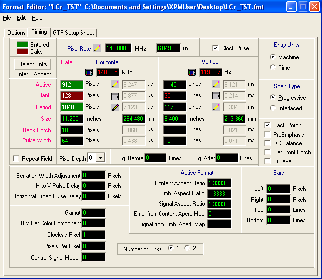

# Lightcrafter

configure Lightcrafter DMD using the USB HID protocol  

from https://github.com/eulerlab/QDSpy/blob/master/Devices/lightcrafter.py

# Installation (Linux)

```
sudo apt install libhidapi-libusb0
pip install git+https://github.com/ElTinmar/Lightcrafter.git@main
```

# Aspect ratio

Due to the DMD geometry (diagonal vs orthogonal mirror array), the aspect ratio is modified when using native resolution: one must correct the patterns shown by: 
$$(1,\frac{1}{2})$$

# Troubleshooting

AttributeError: /lib/x86_64-linux-gnu/libhidapi-hidraw.so.0: undefined symbol: hid_get_input_report

there are two pip packages: hidapi and hid

you need to install hidapi and remove hid 

# Setting up the lightcrafter to display at 120 Hz

The EDID is programmed at the factory with resolutions of 1280 x 800 and 912 x 1140 at 60 Hz.
To make the display available at 120 Hz, I recommend to update the EDID on the device.

## 1. Set the J8 jumper to enable writing to EDID EEPROM



Source: https://www.ti.com/lit/ug/dlpu011f/dlpu011f.pdf

## 2. Install programms to read and write the EEPROM via I2C through the HDMI cable

```
sudo apt install ghex
sudo apt install read-edid
sudo apt install i2c-tools
sudo apt install wxedid
git clone https://github.com/ChalkElec/write-edid.git
```

## 3. Make a backup of the original EDID

Plug the HDMI cable in the Lightcrafter and your machine. The EEPROM can be accessed 
even if the Lightcrafter is turned off.

### 3.1 Identify on which I2C bus the Lightcrafter is

List all the I2C buses:

```
i2cdetect -l
```

If necessary try to access EDID for each detected device using 

```
sudo get-edid -b X | parse-edid 
```

replace X by the bus number identified earlier, in my case it was

```
sudo get-edid -b 2 | parse-edid 
```

### 3.1 Dump EDID to a file

Once you have found the right bus, save the EDID to a file

```
sudo get-edid -b 2 > original.bin 
``` 

You can check and modify the content of the file using an hexadecimal editor such as ghex or with wxedid.

### 3.2 Upload EDID to device

```
sudo ./write-edid 2 original.bin 
``` 

### 3.3 EDID information for TI forum

https://e2e.ti.com/support/dlp-products-group/dlp/f/dlp-products-forum/729572/linux-dlplcr4500evm-dlp4500-works-at-115-hz-but-not-120-hz

```


			Time: 4:03:32 PM
			Date: Monday, September 01, 2014
			EDID Manager Version: 1.0.0.14
	___________________________________________________________________

	Block 0 (EDID Base Block), Bytes 0 - 127,  128  BYTES OF EDID CODE:

		        0   1   2   3   4   5   6   7   8   9   
		000  |  00  FF  FF  FF  FF  FF  FF  00  11  90
		010  |  00  45  01  00  00  00  0D  17  01  03
		020  |  80  34  20  A0  02  EE  95  A3  54  4C
		030  |  99  26  0F  50  54  00  00  00  01  00
		040  |  01  00  01  00  01  00  01  00  01  00
		050  |  01  00  01  00  08  39  90  80  30  74
		060  |  1E  40  08  40  A6  00  06  44  21  00
		070  |  00  1E  A8  20  90  18  31  74  1E  40
		080  |  28  40  A6  00  06  44  21  00  00  1E
		090  |  00  00  00  FC  00  4C  43  72  20  34
		100  |  35  30  30  0A  20  20  20  20  00  00
		110  |  00  FA  00  1D  00  3B  00  3F  0A  20
		120  |  20  01  00  01  00  0A  00  16

(8-9)    	ID Manufacture Name : DLP
(10-11)  	ID Product Code     : 4500
(12-15)  	ID Serial Number    : N/A
(16)     	Week of Manufacture : 13
(17)     	Year of Manufacture : 2013

(18)     	EDID Version Number : 1
(19)     	EDID Revision Number: 3

(20)     	Video Input Definition       : Digital
(21)     	Maximum Horizontal Image Size: 52 cm
(22)     	Maximum Vertical Image Size  : 32 cm
(23)     	Display Gamma                : 2.60
(24)     	Power Management and Supported Feature(s):
			Monochrome, Non-sRGB, Preferred Timing Mode

(25-34)  	Color Characteristics
			Red Chromaticity   :  Rx = 0.636  Ry = 0.330
			Green Chromaticity :  Gx = 0.300  Gy = 0.596
			Blue Chromaticity  :  Bx = 0.150  By = 0.056
			Default White Point:  Wx = 0.313  Wy = 0.329

(35)     	Established Timings I (Not Used)

(36)     	Established Timings II (Not Used)

(37)     	Manufacturer's Timings (Not Used)

(38-53)  	Standard Timings (Not Used)

(54-71)  	Detailed Descriptor #1: Preferred Detailed Timing (912x1140 @ 120Hz)

			Pixel Clock            : 146 MHz
			Horizontal Image Size  : 518 mm
			Vertical Image Size    : 324 mm
			Refresh Mode           : Non-interlaced
			Normal Display, No Stereo

			Horizontal:
				Active Time     : 912 Pixels
				Blanking Time   : 128 Pixels
				Sync Offset     : 8 Pixels
				Sync Pulse Width: 64 Pixels
				Border          : 0 Pixels
				Frequency       : 140 kHz

			Vertical:
				Active Time     : 1140 Lines
				Blanking Time   : 30 Lines
				Sync Offset     : 10 Lines
				Sync Pulse Width: 6 Lines
				Border          : 0 Lines

			Digital Separate, Horizontal Polarity (+), Vertical Polarity (+)

			Modeline: "912x1140" 146.000 912 920 984 1040 1140 1150 1156 1170 +hsync +vsync

(72-89)  	Detailed Descriptor #2: Detailed Timing (912x1140 @ 60Hz)

			Pixel Clock            : 83.6 MHz
			Horizontal Image Size  : 518 mm
			Vertical Image Size    : 324 mm
			Refresh Mode           : Non-interlaced
			Normal Display, No Stereo

			Horizontal:
				Active Time     : 912 Pixels
				Blanking Time   : 280 Pixels
				Sync Offset     : 40 Pixels
				Sync Pulse Width: 64 Pixels
				Border          : 0 Pixels
				Frequency       : 70 kHz

			Vertical:
				Active Time     : 1140 Lines
				Blanking Time   : 30 Lines
				Sync Offset     : 10 Lines
				Sync Pulse Width: 6 Lines
				Border          : 0 Lines

			Digital Separate, Horizontal Polarity (+), Vertical Polarity (+)

			Modeline: "912x1140" 83.600 912 952 1016 1192 1140 1150 1156 1170 +hsync +vsync

(90-107) 	Detailed Descriptor #3: Monitor Name

			Monitor Name: LCr 4500

(108-125)	Detailed Descriptor #4: Standard Timing Identifications


(113-124)	Standard Timings

			480x300 @ 60 Hz (16:10 Aspect Ratio)
			720x450 @ 60 Hz (16:10 Aspect Ratio)
			752x470 @ 70 Hz (16:10 Aspect Ratio)
			504x315 @ 60 Hz (16:10 Aspect Ratio)

(126-127)	Extension Flag and Checksum

			Extension Block(s)  : 0
			Checksum Value      : 22

	___________________________________________________________________
```

## 4. Modify the EDID to advertize 912 x 1140 at 120 Hz

The VESA EDID 1.3 specification can be downloaded from here https://vesa.org/vesa-standards/ 
and details the organization of the 256 bytes. This is a useful resource should you 
wish to implement other resolutions (especially the "Detailed Timing Descriptor" section).

## 4.1 Required timings



Source: https://e2e.ti.com/support/dlp-products-group/dlp/f/dlp-products-forum/699749/dlplcr4500evm-120hz-output-in-video-mode-is-choppy

Based on the DPLC350 documentation, I think Horizontal Front Porch should be at least 56, blanking 130, which means Period at least 1042 

## 4.2 Flashing the EEPROM

Be EXTREMELY careful when you flash the device, if you select the wrong I2C bus you
could permanently damage your computer. Do at your own risk. You have been warned.
I mean seriously.

### compute the checksum

set the correct checksum , use:
github.com/.../EDID_checksum

```
from struct import *
import sys
import os

argvs = sys.argv
argc = len(argvs)

if (argc != 2):
    print("please input edid binary file path for argument")
    quit()

size = os.path.getsize(argvs[1])
if size >= 127:
    f = open(argvs[1],'rb')
    sum = 0
    for i in range(127):
        tmp = unpack('B',f.read(1))[0]
    #    print('read:%d' % tmp)
        sum = sum + tmp

    m = 256 - (sum % 256)
    print('Calced: %x' % m)
    if size >= 128:
        csum = unpack('B',f.read(1))[0]
        print('Actual: %x' % csum)
        if (csum == m):
            print('Match!')
        else:
            print('Un-match...')
else:
    print("Please input binary size > 127 Bytes")
```

### Flash each byte separately

```
sudo i2cset 2 0x50 0x5A 0x08 b # Pixel Clock first 8 bits | 146MHz -> 14600 -> 0x39 0x08
sudo i2cset 2 0x50 0x5B 0x39 b # Pixel Clock last 8 bits
sudo i2cset 2 0x50 0x5C 0x90 b # Horizontal active lower 8 bits | 912
sudo i2cset 2 0x50 0x5D 0x82 b # Horizontal blanking lower 8 bits | 130
sudo i2cset 2 0x50 0x5E 0x30 b # Horizontal active upper 4 bits, Horizontal blanking upper 4 bits
sudo i2cset 2 0x50 0x5F 0x74 b # Vertical active lower 8 bits | 1140
sudo i2cset 2 0x50 0x60 0x1E b # Vertical blanking lower 8 bits | 30
sudo i2cset 2 0x50 0x61 0x40 b # Vertical active upper 4 bits, Vertical blanking upper 4 bits
sudo i2cset 2 0x50 0x62 0x0A b # Horizontal Sync Offset (Back porch), lower 8 bits | 10
sudo i2cset 2 0x50 0x63 0x40 b # Horizontal Sync pulse width, lower 8 bits | 64
sudo i2cset 2 0x50 0x64 0x3A b # Vertical Sync Offset (Back porch) lower 4 bits, Vertical Sync pulse width lower 4 bits | 3, 10
sudo i2cset 2 0x50 0x65 0x00 b # bit 7,6: Horizontal Sync Offset upper 2 bits, bit 5,4: Horizontal Sync pulse width upper 2 bits, bits 3,2: Vertical Sync Offset upper 2 bits, bits 1,0: Vertical Sync pulse width upper 2 bits
sudo i2cset 2 0x50 0x66 0x1C b # Horizontal Image Size (mm), lower 8 bits | 284
sudo i2cset 2 0x50 0x67 0xD5 b # Vertical Image Size (mm), lower 8 bits | 213
sudo i2cset 2 0x50 0x68 0x10 b # Horizontal Image Size upper 4 bits, Vertical Image Size upper 4 bits
sudo i2cset 2 0x50 0x69 0x00 b # Horizontal border | 0
sudo i2cset 2 0x50 0x6A 0x00 b # Vertical border | 0
sudo i2cset 2 0x50 0x6B 0x1E b # Flags
sudo i2cset 2 0x50 0x7F 0x53 b # Checksum
```

Check that the flash was successful:

```
sudo get-edid -b 2 | parse-edid 
```

You should now be able to see the line:

```
Modeline     "Mode 2" 146.00 912 922 986 1042 1140 1150 1160 1177 +hsync +vsync
```

The syntax is the following:

```
               Label | Pixel Clock (MHz) |                    Horizontal Settings                    |                       Vertical Settings                   |     Options
                     |                   | X-Active px | X-Sync Start  | X-Sync End   | X-Total      | Y-Active px | Y-Sync Start | Y-Sync End    | Y-Total      |        |
Modeline    "Mode 2" | 146.00            | 912         | 922           | 986          | 1042         | 1140        | 1150         | 1160          | 1177         | +hsync | +vsync
```
Where 


Sync Start - Active px = Back Porch   
Sync End - Sync Start = Sync Pulse Width    
Total - Active px = Blanking     
Total - Sync End = Front Porch   
Horizontal frequency = Pixel Clock / X-Total  
Vertical frequency =  Pixel Clock / (X-Total* Y-Total)  
Blanking = Sync Pulse Width + Back Porch + Front Porch    
Total = Period = Active + Blanking


This procedure can be adapted to add other resolutions, a good understanding 
of the EDID specification will be necessary.

You should now be able to select 912 x 1140 at 120 Hz in the display 
settings when you plug in the Lightcrafter to a (relatively recent) computer.

# 5. Use the DLP Lightcrafter Pattern mode for 120 Hz display

Only 8-bit grayscale is possible in Pattern mode @120Hz

For some reason, the 120 Hz display rate doesn't seem to work in video mode 
(the Lightcrafter reports a buffer freeze and the image is very choppy).
It does work in 8-bit pattern mode with input from the HDMI and triggers on VSYNC
however, so be sure to select that mode, and dial in an exposure of 8333 
(maximum duration of a frame at 120 Hz).
